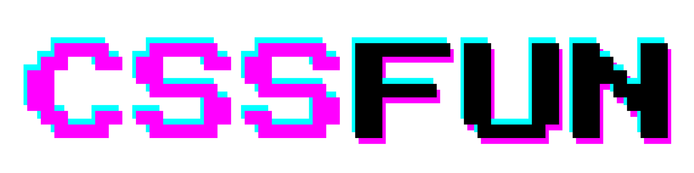

<picture>
    <source media="(prefers-color-scheme: dark)" srcset="docs/logo-dark.png">
    
</picture>

<p align="center">
Next-Generation <a href="https://en.wikipedia.org/wiki/CSS-in-JS"><strong>CSS-in-JS</strong></a> Library
</p>

Write modular **CSS** within your **JavaScript** code with built-in **themes** and **SSR** support.

[](https://app.travis-ci.com/8tentaculos/cssfun)
[](https://www.npmjs.com/package/cssfun)
[](https://unpkg.com/cssfun/dist/cssfun.min.js)
[](https://www.npmjs.com/package/cssfun)
[](https://www.jsdelivr.com/package/npm/cssfun)

## Key Features

- **Component-Scoped Styles** ✨  
  **CSSFUN** scopes styles to the component, preventing style leakage and promoting modularity. It keeps both logic 
  and styling in the same file for easier management.

- **Framework-Agnostic** 🌐  
  **CSSFUN** works with any framework, whether it’s React, Vue, or vanilla JavaScript. At just **2KB**, it adds 
  minimal overhead to your projects.

- **No Build Tools Required** 🛠️  
  **CSSFUN** can be used directly in the browser, eliminating the need for complex build tools or configurations.

- **Server-Side Rendering (SSR) Support** 🚀  
  **CSSFUN** supports server-side rendering out of the box, optimizing initial load times without duplicating styles.

- **Built-in Theme Management** 🎨  
  With built-in theme support, **CSSFUN** uses CSS variables to manage light, dark, and system color schemes. Themes 
  update automatically based on user preferences, no re-renders needed.

## Getting Started

### Using npm

```bash
$ npm install cssfun
```

```javascript
import { css } from 'cssfun';
```

### Using ES modules

```javascript
import { css } from 'https://esm.run/cssfun';
```

### Using `<script>` tag

```html
<script src="https://cdn.jsdelivr.net/npm/cssfun"></script>
```

```javascript
const { css } = CSSFUN;
```

### Create your styles
```javascript
const { classes } = css({
    button : {
        backgroundColor : 'blue',
        color : 'white',
        padding : '10px',
        borderRadius : '5px'
    }
});
```

### Apply the styles to your components:
```javascript
const Button = () => <button className={classes.button}>Click me</button>;
```

## Renderers
Renderers are functions that transform style objects into CSS strings.  
When composed, the first renderer receives the styles object, and the final one outputs the 
resulting CSS string.  
By default, StyleSheets are rendered using `parseStyles` and `renderStyles`.  

These are the default renderers transformations:

#### Camelized keys will be transformed to dashed keys
```javascript
css({
    root : {
        backgroundColor : 'black'
    }
}).toString();
```

##### Renders to:
```css
<style id="fun-1">
    .fun-1-root-1 {
        background-color: black;
    }
</style>
```

#### Nested selectors will be expanded
- **Use `&` to reference the selector of the parent rule**

    ```javascript
    css({
        button : {
            backgroundColor : 'white',
            '&:hover' : {
                backgroundColor : 'black'
            },
            '& span' : {
                color : 'blue'
            }
        }
    }).toString();
    ```

    ##### Renders to:
    ```css
    <style id="fun-1">
        .fun-1-button-1 {
            background-color: white;
        }
        .fun-1-button-1:hover {
            background-color: black;
        }
        .fun-1-button-1 span {
            color: blue;
        }
    </style>
    ```

- **Deep nesting**

    ```javascript
    css({
        button : {
            backgroundColor : 'white',
            '&:active' : {
                backgroundColor : 'black',
                '&:hover' : {
                    backgroundColor : 'blue'
                }
            }
        }
    }).toString();
    ```

    ##### Renders to:
    ```css
    <style id="fun-1">
        .fun-1-button-1 {
            background-color: white;
        }
        .fun-1-button-1:active {
            background-color: black;
        }
        .fun-1-button-1:active:hover {
            background-color: blue;
        }
    </style>
    ```

#### Class references will be replaced by the generated class name
 - **Use `$` to reference a local class within the same StyleSheet instance**

    ```javascript
    css({
        button : {
            backgroundColor : 'white'
        },
        '$button:hover' : {
                backgroundColor : 'black'
            },
        '$button span' : {
            color : 'blue'
        }
    }).toString();
    ```

    ##### Renders to:
    ```css
    <style id="fun-1">
        .fun-1-button-1 {
            background-color: white;
        }
        .fun-1-button-1:hover {
            background-color: black;
        }
        .fun-1-button-1 span {
            color: blue;
        }
    </style>
    ```
 
#### Global selectors will be rendered as global styles

- **Global block**

    ```javascript
    css({
        '@global' : {
            body : {
                backgroundColor : 'black'
            }
        }
    }).toString();
    ```

    ##### Renders to:

    ```css
    <style id="fun-1">
        body {
            background-color : black;
        }
    </style>
    ```

- **Nested global block**

    ```javascript
    css({
        root : {
            '@global' : {
                a : {
                    color : 'black'
                }
            }
        }
    }).toString();
    ```

    ##### Renders to:
    ```css
    <style id="fun-1">
        .fun-1-root-1 a {
            color : black;
        }
    </style>
    ```

- **Global prefix**

    ```javascript
    css({
        '@global body' : {
            backgroundColor : 'black'
        }
    }).toString();
    ```

    ##### Renders to:
    ```css
    <style id="fun-1">
        body {
            background-color : black;
        }
    </style>
    ```
 
### Custom renderers
Renderers can be configured through the `renderers` array on the StyleSheet instance. 
If provided via `options.renderers`, they will be added to the instance. The elements in 
the `renderers` array can either be functions or strings referencing methods of the StyleSheet 
instance. These methods will be bound to the instance automatically.

## Themes
A theme is a StyleSheet that provides access to CSS variables for consistent styling across 
your application. It supports light, dark, and system color schemes, allowing your components 
to automatically adapt to changes in the user's system preferences.

The `createTheme` function accepts a themes object `{ light, dark }`, and an options object, and 
returns a theme StyleSheets.

### Creating a Theme
Create theme StyleSheet.

```javascript
// Create theme
const theme = createTheme({
    light : {
        color : 'black',
        backgroundColor : 'white',
    },
    dark : {
        color : 'white',
        backgroundColor : 'black',
    },
});
```

#### Applying the Theme Class
The generated theme includes a `root` class, which makes all the theme's CSS variables available 
to elements that have this class and their descendants. You can apply this class to the `body` element 
to style the entire application or to the root element of a specific component to style only a part of 
your UI.

```javascript
// Add theme class to the body
document.body.classList.add(theme.classes.root);
```

#### Using Theme Variables in Styles
Your theme object is automatically converted into CSS variables. For instance:

```javascript
{ backgroundLevel1 : 'black' }
```

This will be converted into the CSS variable `--fun-backgroundLevel1`.  

Similarly, more complex theme structures like:  

```javascript
{
    palette : {
        common : { 
            black : '#000'
        }
    }
}
```

will be converted into `--fun-palette-common-black`.  

Use these variables in your component styles, even before the theme is applied. 
Your components will automatically update when the theme or system color scheme changes.

```javascript
const { classes } = css({
    button : {
        color : 'var(--fun-color)',
        backgroundColor : 'var(--fun-backgroundColor)',
    },
});

const Button = ({ label }) => <button className={classes.button}>{label}</button>;
```

## Server-Side Rendering (SSR)

Easily add your styles to the server-rendered HTML by embedding the StyleSheets as a 
string within the `<head>` of your page.

```javascript
// Creating a theme
const theme = createTheme(themes);

// Express route
app.get('*', (req, res) => {
    // Render the app as an HTML string
    const html = renderToString(<App />);
    
    // Get all styles as a string of <style> elements
    const styles = StyleSheet.toString();
    
    // Get the root class name from the theme
    const cls = theme.classes.root;
    
    // Create the full HTML page template
    const template = `
        <!DOCTYPE html>
        <html lang="en">
            <head>
                <meta charset="UTF-8">
                <meta name="viewport" content="width=device-width, initial-scale=1.0">
                <title>Waving Cat</title>
                ${styles}
            </head>
            <body class="${cls}">
                <div id="root">${html}</div>
                <script src="/bundle.js"></script>
            </body>
        </html>
    `;
    
    // Send the complete HTML response
    res.send(template);
});
```

When the app is hydrated on the client side, the styles are preserved and won’t be recreated.

## API Documentation
Complete API documentation can be found [here](/docs/api.md).

## Examples
The `examples` folder contains various sample projects demonstrating how to use **CSSFUN** in 
different environments and frameworks. Each example is a standalone project that you can run locally 
to see **CSSFUN** in action.

### Available Examples
- **[React Example](https://github.com/8tentaculos/cssfun/tree/master/example/react)**: A basic React application demonstrating the use of **CSSFUN** for styling React components. [Try it](https://plnkr.co/plunk/hLIWLlAHGsE2ojO1).
- **[Rasti Example](https://github.com/8tentaculos/cssfun/tree/master/example/rasti)**: A simple Rasti application illustrating how to apply **CSSFUN** to style Rasti components. [Try it](https://plnkr.co/plunk/ivxPfUB5szwcuncf).
- **[Vanilla JS Example](https://github.com/8tentaculos/cssfun/tree/master/example/vanilla)**: A straightforward JavaScript example showing how to use **CSSFUN** for styling HTML components. [Try it](https://plnkr.co/plunk/4ypn83Ru5Z6uwZew).
- **[Rasti with Server-Side Rendering (SSR) Example](https://github.com/8tentaculos/cssfun/tree/master/example/ssr)**: A Rasti application with server-side rendering using Express, highlighting how to use **CSSFUN** for styling in an SSR environment.

## License
CSSFUN is open-source and available under the [MIT License](LICENSE).

## Contributing
Contributions are welcome! Share feature ideas or report bugs on our [GitHub Issues page](https://github.com/8tentaculos/cssfun/issues).
